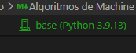
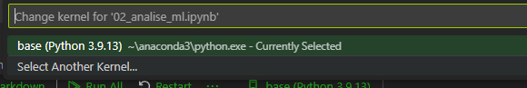
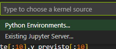
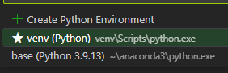

# Leia-me!

Para executar esses códigos é importante utilizar um ambiente virtual.

Assim, na linha de comando, dentro desta mesma pasta, faça:

```powershell
python -m venv venv
.\venv\Scripts\Activate.ps1
```

Se, neste ponto, retornar erro, signifique que o windows não está habilitado para executar scripts. Para contornar esse problema, abra o Powershell em modo de administrador e digite:

```powershell
Set-ExecutionPolicy Unrestricted
```

Selecione a opção "Todos" por meio do ```A``` e pressione enter

Após isto, tente novamente o comando abaixo na linha de comando (dentro da mesma pasta do proeto)

```powershell
.\venv\Scripts\Activate.ps1
```

Caso funcione, aparecerá um algo do tipo ```(venv)``` antes do caminho da pasta

Após isto, rode e aguarde o comando abaixo:

```powershell
pip install -r requirements.txt
```

Após instalar todas as dependências, antes de rodar algum dos notebooks, ao abrir o notebook será necessário escolher o kernel correto.

Isso é possível de ser feito no canto superior direito da janela do jupyter notebook





Ir em "Select another kernel"



Ir em "Python environments"



Neste ponto o VSCode já deve ter localizado o novo kernel a partir do venv.

Selecionar o kernel a partir do venv e rodar o código